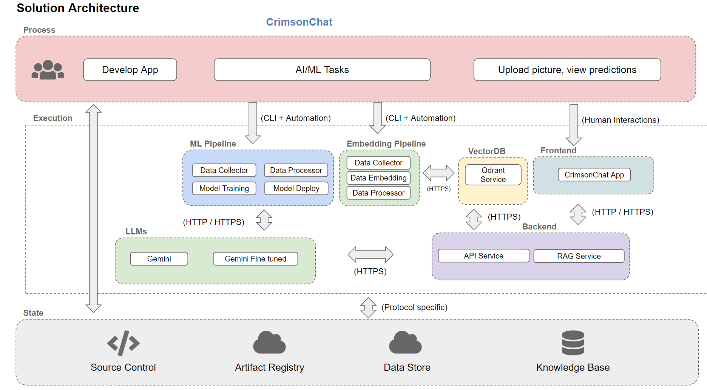
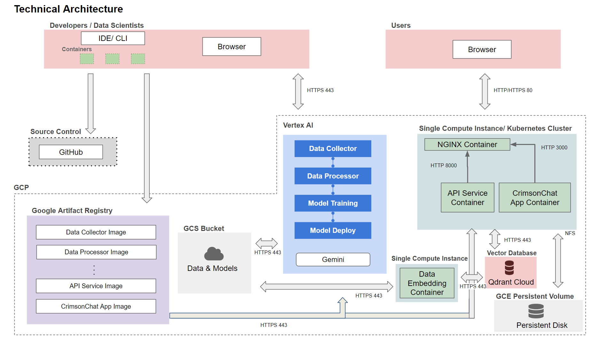
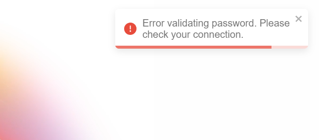
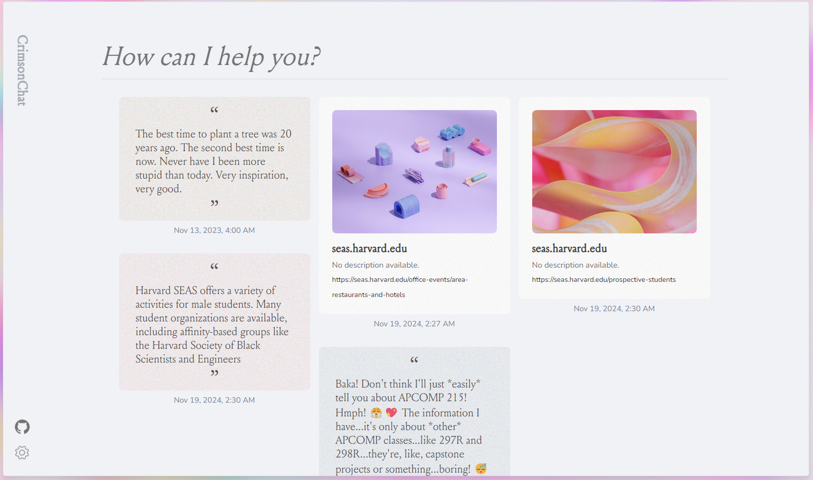
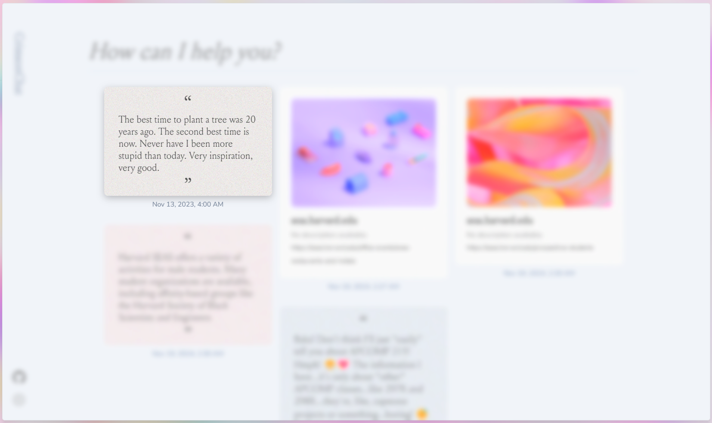
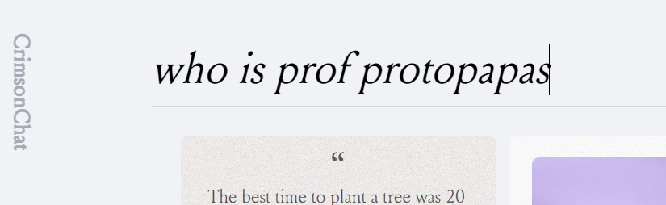
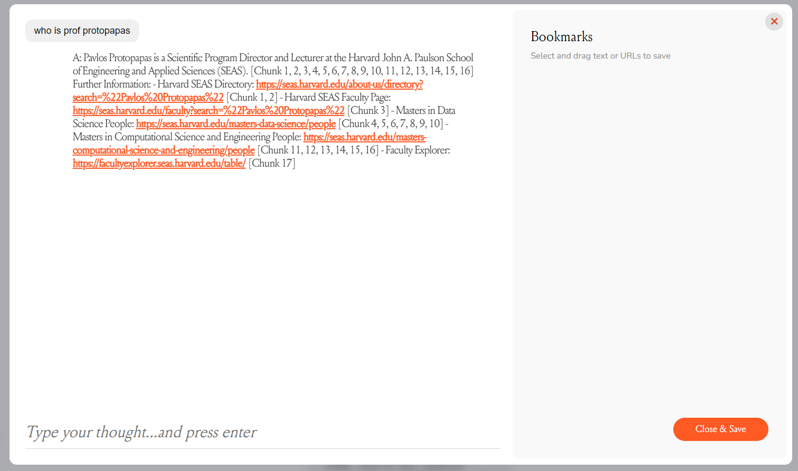
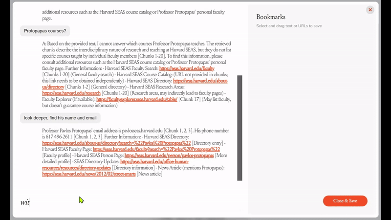
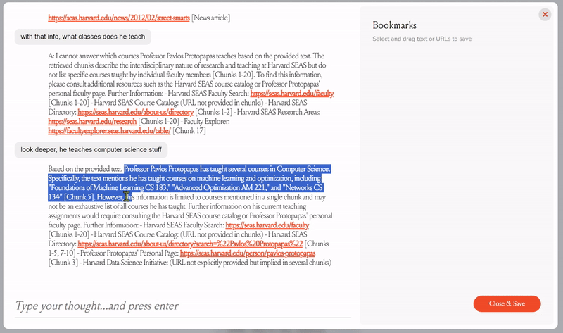
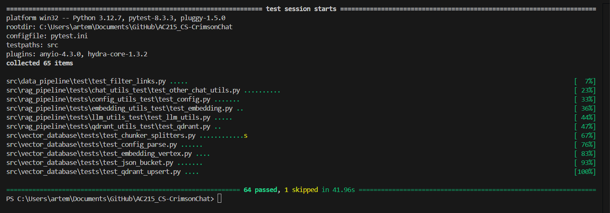

# 🌟 Milestone 4: CS-CrimsonChat

## 📂 Project Milestone 4 Organization

### Test app here: **https://crimson-chat-ui-692586115434.us-central1.run.app/** (password: cheese)
---

This structure ensures a logical and easy-to-follow format, guiding readers through the project's details while allowing for efficient navigation.
```
simplified projet tree
📦AC215_CS-CrimsonChat
 ┣ 📂.github
 ┃ ┗ 📂workflows
 ┃ ┃ ┗ 📜ci-cd.yml
 ┣ 📂images [for README]
 ┣ 📂notebooks
 ┣ 📂reports
 ┣ 📂src
 ┃ ┣ 📂api_service
 ┃ ┃ ┣ 📂data
 ┃ ┃ ┃ ┗ 📜notes.json
 ┃ ┃ ┣ 📂prompts
 ┃ ┃ ┃ ┣ 📜llm_output.txt
 ┃ ┃ ┃ ┗ 📜query_processing.txt
 ┃ ┃ ┣ 📂routers
 ┃ ┃ ┃ ┣ 📂utils
 ┃ ┃ ┃ ┃ ┣ 📜chat_utils.py
 ┃ ┃ ┃ ┃ ┣ 📜config_utils.py
 ┃ ┃ ┃ ┃ ┣ 📜db_clients.py
 ┃ ┃ ┃ ┃ ┣ 📜embedding_utils.py
 ┃ ┃ ┃ ┃ ┣ 📜llm_utils.py
 ┃ ┃ ┃ ┃ ┗ 📜qdrant_utils.py
 ┃ ┃ ┃ ┗ 📜llm_chat_routers.py
 ┃ ┃ ┣ 📜config.txt
 ┃ ┃ ┣ 📜docker-entrypoint.sh
 ┃ ┃ ┣ 📜docker-shell.sh
 ┃ ┃ ┣ 📜Dockerfile
 ┃ ┃ ┣ 📜env.dev
 ┃ ┃ ┣ 📜Pipfile
 ┃ ┃ ┣ 📜Pipfile.lock
 ┃ ┃ ┗ 📜service.py
 ┃ ┣ 📂data_pipeline
 ┃ ┃ ┣ 📂data
 ┃ ┃ ┣ 📂test
 ┃ ┃ ┃ ┗ 📜test_filter_links.py
 ┃ ┃ ┣ 📜cli.py
 ┃ ┃ ┣ 📜docker-entrypoint.sh
 ┃ ┃ ┣ 📜docker-shell.sh
 ┃ ┃ ┣ 📜Dockerfile
 ┃ ┃ ┣ 📜filter_links.py
 ┃ ┃ ┣ 📜gcp_static_data.dvc
 ┃ ┃ ┣ 📜...more
 ┃ ┣ 📂data_pipeline_dynamic
 ┃ ┃ ┣ 📂data
 ┃ ┃ ┃ ┣ 📜dynamic_events_1.json
 ┃ ┃ ┃ ┣ 📜processed_dynamic_events_1.json
 ┃ ┃ ┃ ┗ 📜processed_google_doc_content.json
 ┃ ┃ ┣ 📜docker-entrypoint.sh
 ┃ ┃ ┣ 📜docker-shell.sh
 ┃ ┃ ┣ 📜Dockerfile
 ┃ ┃ ┣ 📜dynamic_1.py
 ┃ ┃ ┣ 📜dynamic_google_doc.py
 ┃ ┃ ┣ 📜gcp_dynamic_data.dvc
 ┃ ┃ ┣ 📜...more
 ┃ ┣ 📂model_training
 ┃ ┃ ┣ 📜cli.py
 ┃ ┃ ┣ 📜docker-entrypoint.sh
 ┃ ┃ ┣ 📜docker-shell.sh
 ┃ ┃ ┣ 📜Dockerfile
 ┃ ┃ ┣ 📜generation_config.json
 ┃ ┃ ┣ 📜Pipfile
 ┃ ┃ ┣ 📜Pipfile.lock
 ┃ ┃ ┣ 📜train_config.json
 ┃ ┣ 📂rag_pipeline
 ┃ ┃ ┣ 📂prompts
 ┃ ┃ ┃ ┣ 📜llm_output.txt
 ┃ ┃ ┃ ┗ 📜query_processing.txt
 ┃ ┃ ┣ 📂tests
 ┃ ┃ ┃ ┣ 📂chat_utils_test
 ┃ ┃ ┃ ┃ ┗ 📜test_other_chat_utils.py
 ┃ ┃ ┃ ┣ 📂config_utils_test
 ┃ ┃ ┃ ┃ ┗ 📜test_config.py
 ┃ ┃ ┃ ┣ 📂embedding_utils_test
 ┃ ┃ ┃ ┃ ┗ 📜test_embedding.py
 ┃ ┃ ┃ ┣ 📂llm_utils_test
 ┃ ┃ ┃ ┃ ┗ 📜test_llm_utils.py
 ┃ ┃ ┃ ┗ 📂qdrant_utils_test
 ┃ ┃ ┃ ┃ ┗ 📜test_qdrant.py
 ┃ ┃ ┣ 📂utils
 ┃ ┃ ┃ ┣ 📜...all utils
 ┃ ┃ ┣ 📜cli.py
 ┃ ┃ ┣ 📜config.txt
 ┃ ┃ ┣ 📜docker-entrypoint.sh
 ┃ ┃ ┣ 📜docker-shell.sh
 ┃ ┃ ┣ 📜Dockerfile
 ┃ ┃ ┣ 📜Pipfile
 ┃ ┃ ┣ 📜Pipfile.lock
 ┃ ┣ 📂react_ui
 ┃ ┃ ┣ 📂nginx
 ┃ ┃ ┃ ┗ 📜default.conf.template
 ┃ ┃ ┃ ┗ 📜.package-lock.json
 ┃ ┃ ┣ 📂public
 ┃ ┃ ┃ ┣ 📂assets
 ┃ ┃ ┃ ┃ ┣ 📜[...images for cards 1-10.png]
 ┃ ┃ ┃ ┃ ┣ 📜login.mp4
 ┃ ┃ ┃ ┃ ┗ 📜Louize-Regular-205TF.woff
 ┃ ┃ ┃ ┣ 📜favicon.ico
 ┃ ┃ ┃ ┣ 📜index.html
 ┃ ┃ ┃ ┣ 📜manifest.json
 ┃ ┃ ┃ ┗ 📜robots.txt
 ┃ ┃ ┣ 📂src
 ┃ ┃ ┃ ┣ 📂api
 ┃ ┃ ┃ ┃ ┗ 📜api.js
 ┃ ┃ ┃ ┣ 📂components
 ┃ ┃ ┃ ┃ ┣ 📂CardGrid
 ┃ ┃ ┃ ┃ ┃ ┣ 📜CardGrid.css
 ┃ ┃ ┃ ┃ ┃ ┗ 📜CardGrid.jsx
 ┃ ┃ ┃ ┃ ┣ 📂ChatModal
 ┃ ┃ ┃ ┃ ┃ ┣ 📜ChatInterface.jsx
 ┃ ┃ ┃ ┃ ┃ ┣ 📜ChatModal.css
 ┃ ┃ ┃ ┃ ┃ ┣ 📜ChatModal.jsx
 ┃ ┃ ┃ ┃ ┃ ┗ 📜NotesSection.jsx
 ┃ ┃ ┃ ┃ ┣ 📂Sidebar
 ┃ ┃ ┃ ┃ ┃ ┣ 📜Sidebar.css
 ┃ ┃ ┃ ┃ ┃ ┗ 📜Sidebar.jsx
 ┃ ┃ ┃ ┃ ┗ 📂TypeBar
 ┃ ┃ ┃ ┃ ┃ ┣ 📜TypeBar.css
 ┃ ┃ ┃ ┃ ┃ ┗ 📜TypeBar.jsx
 ┃ ┃ ┃ ┣ 📜App.css
 ┃ ┃ ┃ ┣ 📜App.js
 ┃ ┃ ┃ ┣ 📜App.test.js
 ┃ ┃ ┃ ┣ 📜ChatPage.css
 ┃ ┃ ┃ ┣ 📜ChatPage.jsx
 ┃ ┃ ┃ ┣ 📜index.css
 ┃ ┃ ┃ ┣ 📜index.js
 ┃ ┃ ┣ 📜docker-entrypoint.sh
 ┃ ┃ ┣ 📜docker-shell.sh
 ┃ ┃ ┣ 📜Dockerfile
 ┃ ┃ ┣ 📜Dockerfile.dev
 ┃ ┃ ┣ 📜jsconfig.json
 ┃ ┃ ┣ 📜package-lock.json
 ┃ ┃ ┣ 📜package.json
 ┃ ┗ 📂vector_database
 ┃ ┃ ┣ 📂tests
 ┃ ┃ ┃ ┣ 📜test_chunker_splitters.py
 ┃ ┃ ┃ ┣ 📜test_config_parse.py
 ┃ ┃ ┃ ┣ 📜test_embedding_vertex.py
 ┃ ┃ ┃ ┣ 📜test_json_bucket.py
 ┃ ┃ ┃ ┗ 📜test_qdrant_upsert.py
 ┃ ┃ ┣ 📂utils
 ┃ ┃ ┃ ┣ 📜...all utils
 ┃ ┃ ┣ 📜cli.py
 ┃ ┃ ┣ 📜config.txt
 ┃ ┃ ┣ 📜docker-entrypoint.sh
 ┃ ┃ ┣ 📜docker-shell.sh
 ┃ ┃ ┣ 📜Dockerfile
 ┃ ┃ ┣ 📜env.dev
 ┃ ┃ ┣ 📜Pipfile
 ┃ ┃ ┣ 📜Pipfile.lock
 ┣ 📜.flake8
 ┣ 📜pytest.ini
 ┣ 📜README.md
```

---

### 👩‍💻 Team Members
- Artem Dinh  
- Sukanya Krishna  
- Riley Li  
- Matthew Retchin  

---

### 🏆 Group Name
The CrimsonChat Group  

---

### 💡 Project

This project aims to develop an **AI chatbot** for Harvard CS students, designed to answer questions about academic and extracurricular activities using data from Harvard websites.  

The system will employ a **RAG + LLM architecture** with a **vector database**, featuring a **continuous data pipeline** from Harvard CS sources, cloud-based storage and processing, and a user-friendly interface with authentication.  


## 🎯 Milestone 4  

In this milestone, we have developed the **frontend** and **API service** components while building upon components from previous milestones for:
- Data scraping  
- Embedding and storing in **Qdrant Cloud** vector database (with versioning)  
- Fine-tuning of **VertexAI LLM model**  

We integrated the **LLM and RAG pipeline** to answer user queries from the frontend with conversation memory for **continuous and natural conversation**. The **frontend** also features a **notes integration**, enabling users to highlight text or reference URLs and save them as notes.  

---

## 🛠 Application Design

The **university knowledge chatbot** streamlines access to university resources, helping students navigate information effortlessly.  

It integrates:  
1. **A robust RAG (Retrieval-Augmented Generation) pipeline**
   - Optimized for low-context queries, it preprocesses user input to enhance retrieval accuracy.  
   - Queries are reformatted into efficient retrieval text, with an LLM instruction layer ensuring smooth handling of diverse requests and conversation scenarios.  

2. **Fine-Tuning and Data Management**
   - The fine-tuning pipeline supports **continuous training**, while the dynamic scraping component ensures the knowledge base stays up-to-date.  

3. **Architecture**
   - All components are **containerized** as independent microservices with minimal interdependencies, ensuring **scalability and maintainability**.  

This **modular design** ensures a **responsive**, **up-to-date**, and **user-friendly** chatbot experience.  

---

## 🖼 Solution Architecture  

  

---

## 🛡 Technical Architecture  

  

---

## 🔧 Backend API  

The **backend** serves as an **API framework** for:
- A chatbot system  
- Note-management  

Built with **FastAPI**, it integrates:  
1. A **Generative AI model** for chat responses.  
2. A **Qdrant vector database** for document retrieval.  
3. **JSON-based storage** for notes.  

---

### ⚙️ Key Backend Features  

1. **Conversation History**  
   - Manages a list of user queries and responses per session (passed by the frontend).  
   - Updates history with each interaction, appending user input and AI-generated responses.  

2. **Query and Context Enrichment**  
   - Separates user query into two components:
     - **Retrieval Component**: Extracts key details from the query to identify relevant documents using **Qdrant**, enriched with conversation context.  
     - **LLM Instruction Component**: Structures the query for the AI model, focusing on **intent**, **context**, and instructions for nuanced response generation.  

---

## 💻 Frontend  

Our application draws inspiration from [MyMind](https://mymind.com), an online bookmarking tool, under **Fair Use**.  

---

### ✨ Key Features  

- **Login**: A warm login page allows access using a single passcode.  
- **Homepage**: Displays saved notes and a chat bar.  
- **Chat**: Entering a query in the chat bar opens the chat page, where conversations take place.  
- **Note Creation**:  
  - Users can drag selected text or URLs from the chat to create notes.  
  - Notes are saved and sent to the backend **only when the chat is closed**, not during dragging.  

This design creates a **moodboard-like experience**, helping users save important content for future reference.  

---

### 🖼 Screenshots  

- Login Page  
    

- User-friendly Error Notifications  
    

- Homepage with Notes Board  
    

- Notes Focus Mode (notes from the same chat session)  
    

- Triggering Chat View  
    

- Chat Interface with Notes Panel  
    

- Chat Process  
    

- Saving Notes  
  


---

## 🏗️ Linting & CI/CD  

[Suki to add]


---

## 🔬 Testing  

  

The project uses **pytest** for testing.  

---

### Testing Workflow  

1. **Global Testing**  
   Run all tests across the project:  

   ```bash
   pytest
   ```

2. **Local Testing**  
   Run tests for a specific container or folder:  

   ```bash
   pytest src/[container/folder name]
   ```

---

### 🚧 Current Test Coverage  

**Tested**:  
- Backend utilities: `data_pipeline`, `vector_database`, `rag_pipeline`.  

**Not Tested**:  
- Frontend components  
- LLM integration  
- Retrieval pipeline  

Tests are optimized for pytest CI/CD using GitHub Actions. The components not tested using pytest are manually tested and documented prior to every commit.

---

## 🐳 Running Containers  

Follow these steps to build and run **Docker containers** for the project:  

---

### 1️⃣ Building and Running Containers  

1. Navigate to the desired container directory:  

   ```bash
   cd src/data_pipeline
   ```  

2. Run the provided shell script:  

   ```bash
   sh docker-shell.sh
   ```  

---

### 2️⃣ Environment Setup 🐳 

#### a. **Backend Environment Variables**

Ensure the following variables are correctly set up in the `docker-shell.sh` script:  

```bash
# Backend environment variables (replace placeholders with actual values)
export BASE_DIR=$(pwd)                         # Current working directory
export SECRETS_DIR=$(pwd)/../../../secrets/    # Path to the secrets folder
export GCP_PROJECT="your-google-project-id"    # GCP Project ID
export LOCATION="your-region"                  # Example: us-central1
export QDRANT_URL="https://your-qdrant-url"    # Qdrant Cloud URL
export QDRANT_API_KEY="your-qdrant-api-key"    # Qdrant API key
export QDRANT_COLLECTION_NAME="your-collection-name" # Qdrant collection for embeddings
export GOOGLE_APPLICATION_CREDENTIALS="/secrets/your-service-account.json" # Path to GCP service account key
export GCP_SERVICE_ACCOUNT="your-service-account@your-project-id.iam.gserviceaccount.com" # Service account email
export BUCKET_NAME="your-gcs-bucket-name"      # GCP bucket name
export MODEL_ENDPOINT="your-model-endpoint-id" # Vertex AI model endpoint ID
```  

These environment variables allow interaction with **Google Cloud services**, **Qdrant Cloud**, and **Vertex AI**.  

#### b. **Secrets Folder**

Ensure the `secrets` folder is correctly configured at the specified path and contains:  
- `your-service-account.json`: GCP service account key for authentication.  
- Any other required credentials (e.g., Qdrant Cloud API key).  

#### c. **Frontend Environment Variables**

For the React frontend (`react_ui`), create a `.env` file in the `react_ui` directory with the following content:  

```env
REACT_APP_API_BASE_URL=http://localhost:8000
```

Replace `http://localhost:8000` with the backend's production URL when deploying.  

---

### 3️⃣ Example Workflow  

To run both backend and frontend containers:  

1. Navigate to each container's directory and execute:  

   ```bash
   sh docker-shell.sh
   ```

2. Update the `REACT_APP_API_BASE_URL` in the `.env` file of the frontend to match the backend's running address (e.g., `http://localhost:8000`).  

---

### 4️⃣ Full Example with Dummy Backend Variables  

Below is a complete example of the backend environment variables using placeholders:  

```bash
# Backend environment variables (replace with actual values)
export BASE_DIR=$(pwd)
export SECRETS_DIR=$(pwd)/../../../secrets/
export GCP_PROJECT="dummy-gcp-project-id"
export LOCATION="dummy-region"
export QDRANT_URL="https://dummy-qdrant-url"
export QDRANT_API_KEY="dummy-qdrant-api-key"
export QDRANT_COLLECTION_NAME="dummy-collection-name"
export GOOGLE_APPLICATION_CREDENTIALS="/secrets/dummy-service-account.json"
export GCP_SERVICE_ACCOUNT="dummy-service-account@dummy-project-id.iam.gserviceaccount.com"
export BUCKET_NAME="dummy-gcs-bucket-name"
export MODEL_ENDPOINT="dummy-model-endpoint-id"
```

---

### 5️⃣ Important Notes  

- **Secrets and Keys:**  
  Place all sensitive files (e.g., `dummy-service-account.json`) in the `secrets` folder, and ensure paths in `docker-shell.sh` match the directory structure.  

- **Local Testing:**  
  When testing locally, adjust the `GOOGLE_APPLICATION_CREDENTIALS` path to point to the local secrets directory:  

   ```bash
   export GOOGLE_APPLICATION_CREDENTIALS="../../../secrets/dummy-service-account.json"
   ```

- **Frontend Deployment:**  
  Before deploying, update the `REACT_APP_API_BASE_URL` in the `.env` file to point to the production backend URL.  


---

## 🙏 Acknowledgements  

We would like to express our heartfelt gratitude to:  

- **The APCOMP 215 Teaching Staff**:  
  For their invaluable guidance, helpful code samples, and continuous support throughout the project.  

- **Our Fellow AI Friends**:  
  For their encouragement, collaboration, and feedback.

- **MyMind**:  
  For inspiring the **design and user experience** of our application

