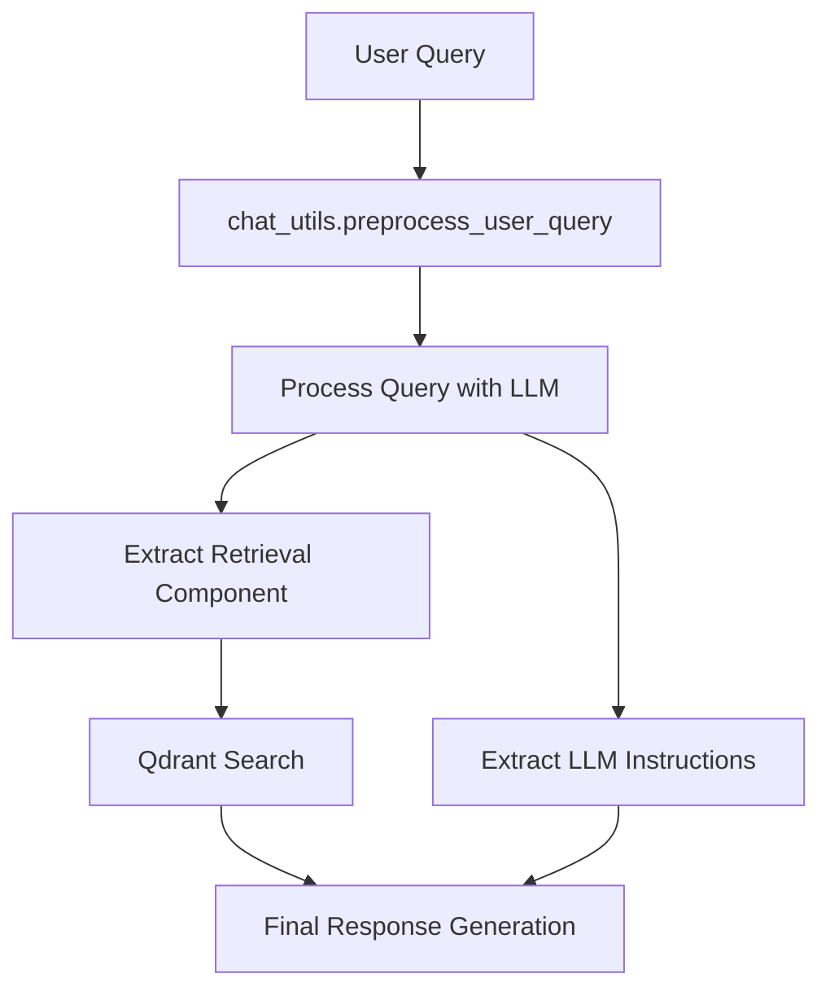

# 🚀 RAG Pipeline

A robust Retrieval-Augmented Generation pipeline leveraging Google's Vertex AI for embeddings and Qdrant for vector storage. This pipeline enables efficient document retrieval and AI-powered conversations with your data.

## Run the Pipeline
```bash
# Using CLI with chat interface
python cli.py --config config.txt
```

## 📁 Directory Structure
```
rag_pipeline/
├── prompts/
│   ├── llm_output.txt          # LLM response formatting prompts
│   └── query_processing.txt    # Query preprocessing prompts
├── utils/
│   ├── chat_utils.py          # Chat session management & query processing
│   ├── config_utils.py        # Configuration handling & CLI arguments
│   ├── db_clients.py          # Database client utilities
│   ├── embedding_utils.py     # Vertex AI embedding generation
│   ├── history.py            # Chat history management
│   ├── llm_utils.py          # LLM interaction utilities
│   └── qdrant_utils.py       # Qdrant vector store operations
├── cli.py                    # Command-line interface with chat history
├── ui.py                     # User interface implementation
├── config.txt               # Core configuration parameters
├── docker-entrypoint.sh    # Docker container initialization script
├── docker-shell.sh         # Development environment script
├── Dockerfile              # Container definition and setup
├── env.dev                 # Environment variables for development
├── Pipfile                 # Python package dependencies
└── Pipfile.lock           # Locked Python dependencies
```

## 🔄 System Architecture & Flow

The RAG pipeline operates through a sophisticated interaction of multiple components. Here's how they work together:

### 1. Query Processing Flow


### 2. Component Interactions

#### 2.1 Query Preprocessing (`chat_utils.py`)
```python
instruction_dict = preprocess_user_query(
    query, generative_model, config, chat_history, last_instruction_dict, prompts
)
```
- Takes raw user input and chat history
- Uses LLM to structure query into two components:
  - `retrieval_component`: Optimized for document search
  - `llm_instruction_component`: Guidelines for response formatting

#### 2.2 Knowledge Retrieval (`qdrant_utils.py`)
```python
knowledge_documents = get_documents_from_qdrant(
    instruction_dict["retrieval_component"], 
    config, 
    rag_config, 
    qdrant_client
)
```
- Uses processed query to search Qdrant vector database
- Retrieves most relevant documents using dense embeddings
- Returns formatted documents with source attribution

#### 2.3 Response Generation (`llm_utils.py`)
```python
final_prompt = create_final_prompt(
    user_query=query,
    instruction_dict=instruction_dict["llm_instruction_component"],
    knowledge_documents=knowledge_documents,
    chat_history=chat_history,
    prompts=prompts
)

response = generate_llm_response(
    final_prompt=final_prompt,
    generative_model=generative_model,
    rag_config=rag_config
)
```
- Combines retrieved knowledge with query context
- Applies formatting instructions
- Generates contextual response using Vertex AI

### 3. Conversational Features

#### 3.1 Chat History Management
```python
# History storage and token management
chat_history.append(f"User: {user_query}")
chat_history.append(f"Response: {llm_response}")

should_end, reason = manage_chat_session(
    query=user_query,
    chat_history=chat_history,
    rag_config={"max_history_tokens": 8000}
)
```
- Maintains conversation context
- Monitors token usage to prevent context overflow
- Automatically manages session length
- Preserves human-AI interaction flow

#### 3.2 Format Instruction Memory
```python
# Storing and reusing format instructions
last_instruction_dict = instruction_dict

# Next query uses previous formatting
instruction_dict = preprocess_user_query(
    query, 
    generative_model, 
    config, 
    chat_history,
    last_instruction_dict,  # Previous formatting context
    prompts
)
```
- Maintains consistent response formatting across conversation
- Preserves user preferences for output structure
- Allows format evolution based on conversation flow

#### 3.3 Context-Aware Retrieval
```python
def add_context_to_query(query, chat_history, last_instruction_dict):
    """
    Enriches query with relevant context for better embedding search
    """
    if chat_history and len(chat_history) % 2 == 0:
        last_message = chat_history[-1]
        query = f"Context: {last_message}\nUser Query: {query}"
    
    if last_instruction_dict.get("llm_instruction_component"):
        query += f", prior instructions: {str(last_instruction_dict['llm_instruction_component'])}"
    return query
```
- Incorporates previous responses into search context
- Enables accurate handling of follow-up questions
- Example transformations:
  ```
  User: "What about its performance?"
  Enhanced: "Context: Previous response about system architecture
            User Query: What about its performance?"
  ```

#### 3.4 Conversation Flow Example
```
1. Initial Query:
   User: "Tell me about the system architecture"
   → Stores response format (e.g., bullet points)
   → Saves response in history

2. Follow-up:
   User: "What about its performance?"
   → Combines previous context with new query
   → Maintains consistent formatting
   → Retrieves relevant documents using enhanced context

3. Contextual Processing:
   - Previous response informs document retrieval
   - Format instructions maintain consistency
   - Chat history guides response generation
```

### 4. Document Structure in Vector Database
```python
Document(
    page_content="Document text",
    metadata={
        'id': 'unique-id',
        'url': 'source-url',
        'timestamp': '2024-10-10T00:00:00Z',
        'embedding': [0.1, 0.2, ...]  # Vertex AI embeddings
    }
)
```

### 5. RAG Configuration Parameters
```python
{
    "temperature": 0.75,        # Response creativity
    "max_output_tokens": 2000,  # Response length limit
    "top_p": 0.95,             # Sampling parameter
    "num_documents": 20,        # Retrieved documents count
    "max_history_tokens": 8000  # Chat history limit
}
```

## 🌟 Prerequisites

### Required Environment Variables (`env.dev`)
Create an `env.dev` file with the following variables:
```bash
# Google Cloud Configuration
GCP_PROJECT="your-project-id"
LOCATION="us-central1"  # Your GCP region
GOOGLE_APPLICATION_CREDENTIALS="/secrets/key.json"
MODEL_ENDPOINT="your-model-endpoint"

# Qdrant Configuration
QDRANT_URL="your-qdrant-url"
QDRANT_API_KEY="your-qdrant-api-key"

# Docker Configuration (for development)
BASE_DIR="/path/to/your/project"
SECRETS_DIR="/path/to/your/secrets"
GCS_BUCKET_NAME="your-bucket-name"
```

## 🚀 Quick Start

1. **Setup Environment**
   ```bash
   # Copy and configure environment variables
   cp env.dev .env
   # Edit .env with your settings
   
   # Install dependencies
   pipenv install
   ```

2. **Configure the Pipeline**
   Default configuration (`config.txt`):
   ```ini
   testing_json = ./sample.json
   embedding_model = text-embedding-004
   vector_dim = 256
   chunking_method = simple
   qdrant_collection = ms3-production_v256_te004
   chunk_size = 750
   chunk_overlap = 20
   breakpoint_threshold_type = percentile
   buffer_size = 1
   breakpoint_threshold_amount = 95
   ```

3. **Run the Pipeline**
   ```bash
   # Using CLI with chat interface
   python cli.py --config config.txt
   ```

## 🐳 Docker Support

### Development Environment
```bash
# Start development shell
./docker-shell.sh
```

### Production Deployment
```bash
# Build container
docker build -t rag_pipeline .

# Run container
docker run --rm --name rag_pipeline -ti \
  -v ${BASE_DIR}:/app \
  -v ${SECRETS_DIR}:/secrets \
  -e GOOGLE_APPLICATION_CREDENTIALS=${GOOGLE_APPLICATION_CREDENTIALS} \
  -e GCP_PROJECT=${GCP_PROJECT} \
  -e GCS_BUCKET_NAME=${GCS_BUCKET_NAME} \
  -p 8501:8501 \
  rag_pipeline
```

The Docker setup includes:
- Python 3.11 base image
- Development dependencies (git, ffmpeg)
- Pipenv for dependency management
- Volume mounts for application code and secrets
- Environment variable passthrough

## 🔧 Advanced Configuration

### Chunking Methods
- **Simple Chunking**
  ```bash
  --chunking_method simple
  --chunk_size 750
  --chunk_overlap 20
  ```

- **Semantic Chunking**
  ```bash
  --chunking_method semantic
  --breakpoint_threshold_type percentile
  --buffer_size 1
  --breakpoint_threshold_amount 95
  ```

### Vertex AI Models
- Default embedding model: `text-embedding-004`
- Vector dimensions: 256
- Collection name format: `{environment}-{model}-{dims}`

## 👥 Author
Artem Dinh (Last updated: 10/10/2024)

## 📜 License
[Your license here]